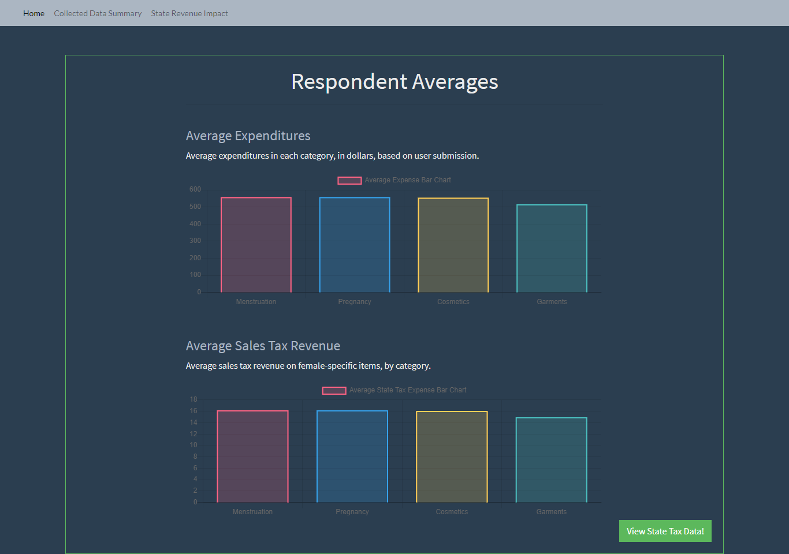

# HER COSST
### Colorado State Sales Tax

This app takes user-submitted data to estimate the amount of Colorado state sales tax that was collected on purchases of female-specific items.  It uses a Node and Express Web Server, and is backed by a MySQL Database.



## Functionality 💪
#### Here's how the app works: 
* HER COSST uses api and html routes to retrieve user-submitted data and display bootstrap pages.  
* User data is mathed, where appropriate, and inserted into our MySQL table.

```javascript
  if ($("input:radio[name ='menstruationMonthly']:checked").val() === "true") {
    menstruationTotal = parseInt($("#menstruation").val().trim()) * 12
  } else {
    menstruationTotal = parseInt($("#menstruation").val().trim());
  };
```
```javascript
var API = {
  saveSurvey: function (newUserInput) {
    return $.post("/api/survey", newUserInput)
      .then(data => {
        var id = data.id;
        console.log("index.js data: ", data);
        window.location = `/personalData/${id}`
      })
  },
```

* Average figures are calculated, stored, and updated in their own MySQL table.

* Upon submission, the user is taken to a personal data page, which uses Chart JS to display charts of the user's expenditures by category and the percent of the user's income that was spent on female-specific items.

* The next page uses Chart JS to display the respondent averages - both the average dollar amount and the average tax collected in each category.

* The final page displays the estimated percent of the whole Colorado state sales tax revenue that was contributed by the purchase of female-specific items.  This number will grow as more users submit data.

## Future Development 🚧 

* Offer the user the option to email personal data.
* Display each user's individual estimated sales tax contributions on the personal data page.
* Display a projection of the total Colorado population based on current responses.

## Built With 🔧

* [Bootstrap](https://getbootstrap.com/) 
* [JQuery](https://cdnjs.cloudflare.com/ajax/libs/jquery/3.2.1/jquery.min.js) 
* [Express](https://www.npmjs.com/package/express)
* [Handlebars](https://handlebarsjs.com/)
* [Sequelize](https://www.npmjs.com/package/sequelize)
* [Node JS](https://nodejs.org/en/)
* [Chart JS](https://www.chartjs.org/)


## Authors ⌨️

* **Amber Moreyra** - [ambermoreyra](https://github.com/ambermoreyra)
* **Christelle Mangama** - [mangama](https://github.com/mangama)
* **Genevieve DePriest** - [gdepriest](https://github.com/gdepriest)

## Acknowledgments 🌟

* Amber Burroughs, Tutoring badass
* Lindsey, TA & Tutoring goddess
* Grace, TA goddess
* Jaq, 
* Sarah Cullen, Maestro